# Сети в Linux

## Part 1. Инструмент **ipcalc**

### 1.1. Сети и маски

#### 1. Адрес сети *192.167.38.54/13*

#### 2. Перевод маски 255.255.255.0 в префиксную и двоичную запись, /15 в обычную и двоичную, 11111111.11111111.11111111.11110000 в обычную и префиксную

- 255.255.255.0

-  /15

- 11111111.11111111.11111111.11110000

#### 3. Минимальный и максимальный хост в сети 12.167.38.4 при масках: /8, 11111111.11111111.00000000.00000000, 255.255.254.0 и /4

- 12.167.38.4/8

- При маске 11111111.11111111.00000000.00000000

- При маске 255.255.254.0

- 12.167.38.4/4

### 1.2. localhost

#### Определи и запиши в отчёт, можно ли обратиться к приложению, работающему на localhost, со следующими IP: 194.34.23.100, 127.0.0.2, 127.1.0.1, 128.0.0.1

Как видно из изображения обращение к следующим IP возможно: 127.0.0.2, 127.1.0.1. К IP 194.34.23.100, 128.0.0.1, подлючиться не возможно.

### 1.3. Диапазоны и сегменты сетей

#### 1. Какие из перечисленных IP можно использовать в качестве публичного, а какие только в качестве частных: 10.0.0.45, 134.43.0.2, 192.168.4.2, 172.20.250.4, 172.0.2.1, 192.172.0.1, 172.68.0.2, 172.16.255.255, 10.10.10.10, 192.169.168.1

- 10.0.0.45 частная

- 10.10.10.10 частная

- 134.43.0.2 публичная

- 172.0.2.1 публичная

- 172.16.255.255 частная

- 172.20.250.4 частная

- 172.68.0.2 публичная

- 192.168.4.2 частная

- 192.169.168.1 публичная

- 192.172.0.1 публичная

#### 2. Какие из перечисленных IP адресов шлюза возможны у сети 10.10.0.0/18: 10.0.0.1, 10.10.0.2, 10.10.10.10, 10.10.100.1, 10.10.1.255

Как видно из изображения в диапазон входят IP:
- 10.10.0.2
- 10.10.10.10
- 10.10.1.255

Не входят IP:
- 10.0.0.1
- 10.10.100.1

## Part 2. Статическая маршрутизация между двумя машинами

#### A.1 Поднимаем две виртуальные машины ws1 и ws2.
- В настройках каждой машины во вкладке Сеть задаем Тип подключения: Внутренняя сеть.
- Запускаем обе машины и устанавливаем им соответствующие имена хоста.

#### A.2 С помощью команды ip a смотрим существующие сетевые интерфейсы

##### Опиcf сетевой интерфейс, соответствующий внутренней сети, на обеих машинах и задать следующие адреса и маски: ws1 - 192.168.100.10, маска /16, ws2 - 172.24.116.8, маска /12.
Используем следующую команду для открытия файла и установки в нём статического адреса.

> `sudo nano /etc/netplan/00-installer-config.yaml`

- `/etc/netplan/00-installer-config.yaml`- файл который нужно отредтировать на каждой машине. Этот файл отвечает за настройку сети.

Изначально это файл выглядит одинакого на обоих машинах 

Изменяем файлы согласно заданию.

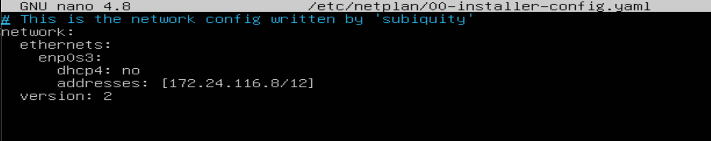

Выполним команду netplan apply для перезапуска сервиса сети
> `sudo netplan apply`

С помощь команды ` netstat -nr ` проверяем номера машин.
Где: 
- `-n` - отбражение адресов в числовом виде;
- `-r` - отображение в виде таблицы.

С помощью следующей команды перепроверяем настройки

> `ip a`

### 2.1. Добавление статического маршрута вручную

#### 2.1.1 Добавим статический маршрут от одной машины до другой и обратно

> ` sudo ip route add 172.24.116.8 dev enp0s3 `

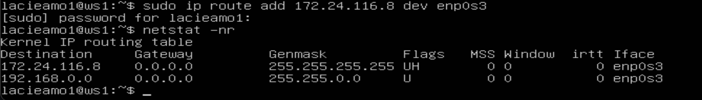

> ` sudo ip route add 192.168.100.10 dev enp0s3 `

#### 2.1.2 Пропингуем соединение между машинами с помощью следующей команды

> `ping -c 5 <IP-address>`

- `-c` - указывает количество пакетов.

> `ping -c 5 172.24.116.8`

> `ping -c 5 192.168.100.10`

### 2.2. Добавление статического маршрута с сохранением

Перезапустив машины замечает что данные для связи не сохранилась

> ` ip r `

Добавляем статический маршрут от одной машины до другой, редактируя файл `etc/netplan/00-installer-config.yaml`.

Применяем новые настройки и попингуем

## Past 3. Утилита iperf3

### 3.1 Скорость соединения
Базовой единицей скорости передачи информации является бит в секунду (бит/с). Разница между байтами в секунду (Б/с) и битами в секунду (бит/c) такая же, как разница между байтами (Б) и битами (бит): 1 Б/с = 8 бит/с. Точно так же разница между килобайтами в секунду (КБ/с) и Б/с такая же, как разница между килобайтами и байтами: 1 КБ/с = 1024 Б/с. И так далее.

Перевести и записать в отчёт:

- 8 Mbps (мегабит в секуду) = 1 MB/s (мегабайт в секунду)

- 100 MB/s (мегабайт в секунду) = 800 000 Kbps (килобит в секунду)

- 1 Gbps (гигабит в секунду) = 1 000 Mbps (мегабит в секунду)

### 3.2 Утилита iperf3

Установка утилиты происходит путём изменения сетевого 1 адаптера (в настройках виртуальной машины) на NAT и добавлением 2 адаптерата внутерней сетью в одоих машинах.

- Первый адаптер:

Так же мы должны изменить найстройки файла `etc/netplan/00-installer-config.yaml` в обоих машинах.

- ws1

- ws2

Применяем и пингуем ya.ru другую виртуальную машину:

- ws1

- ws2

После всех этих манитуляции у нас есть достут в интернет и остается связь между машинами.
Устанавливаем утилиту iperf3

Запускаем утилиту на ws1 в режиме сервер с флагом `-s`. Она будет ожидать пока не запустится этаже утилита на ws2 в режиме клиента.

## Part 4. Сетевой экран
**Сетевой или межсетевой** экран – это комплекс программных или аппаратных средств, которые позволяют осуществлять фильтрацию и контроль проходящих через него пакетов в соответствии с заданными заранее параметрами.
Основная задача межсетевого экрана – это защита компьютерных сетей или конкретных узлов от доступа злоумышленников. Межсетевые экраны часто называют фильтрами, что связанно с их основной задачей – фильтровать пакеты, которые не подходят под критерии, определенные в конфигурации.

### 4.1. Утилита iptables

**iptables** — это утилита для настройки и управления правилами фильтрации сетевого трафика в операционной системе Linux. Она позволяет администратору управлять входящим, исходящим и пересылаемым сетевым трафиком на основе заданных правил.

Основные функции `iptables` включают:

- Фильтрация пакетов: Определение, какие пакеты могут пройти через сетевой интерфейс, а какие должны быть заблокированы.
- Маршрутизация пакетов: Перенаправление пакетов с одного сетевого интерфейса на другой.
- NAT (Network Address Translation): Изменение IP-адресов и/или номеров портов в пакетах для обеспечения связи между различными сетями.
- Логирование: Запись информации о сетевом трафике для целей мониторинга и анализа.

`iptables` работает с таблицами, каждая из которых содержит цепочки правил. Эти правила определяют, что делать с пакетами в зависимости от различных критериев, таких как IP-адрес источника и назначения, номер порта, тип протокола и другие параметры.

Создаем файл `/etc/firewall.sh`, имитирующий фаерволл, на ws1 и ws2

> ` sudo nano /etc/firewall.sh `

Разница между стратегиями, применёнными в первом и втором файлах, заключается в следующем: в утилите `iptables`` правила выполняются сверху вниз. На первой машине первым указано запрещающее правило на выход, поэтому она не сможет пропинговать другую машину. У второй машины, наоброт - первым указано разрешающее правило, значит она сможет пропинговать другую машину.

### 4.2. Утилита nmap

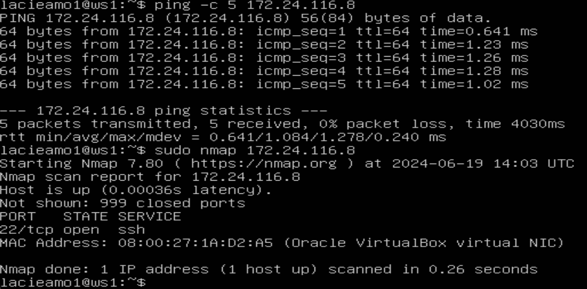

- Сохраняем дампы образов виртуальных машин.

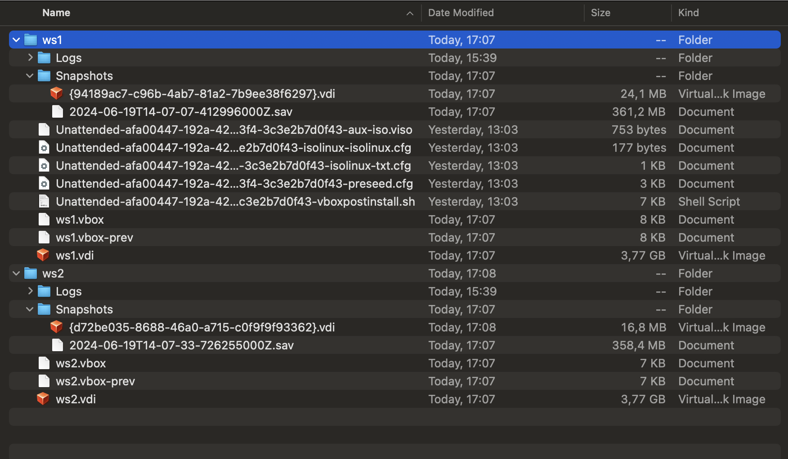

## Part 5. Статическая маршрутизация сети

Поднять пять виртуальных машин (3 рабочие станции (ws11, ws21, ws22) и 2 роутера (r1, r2)).

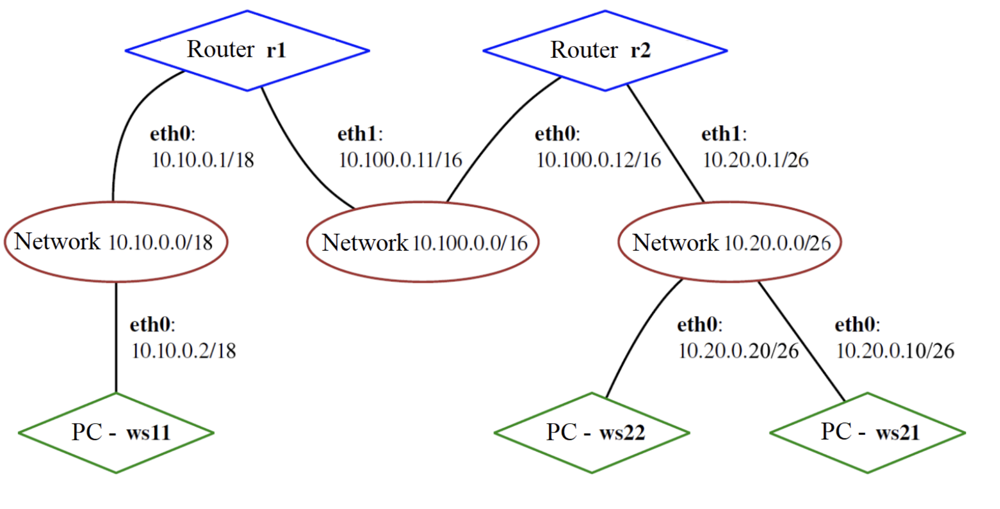

### 5.1. Настройка адресов машин

Изменияем конфигурации машин в `etc/netplan/00-installer-config.yaml` согласно сети на рисунке.

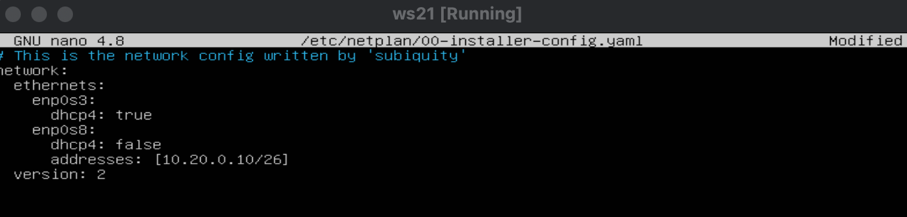

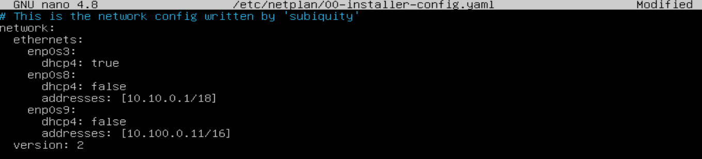

Применяем изменения и проверяем при помощи команды `ip -4 a`

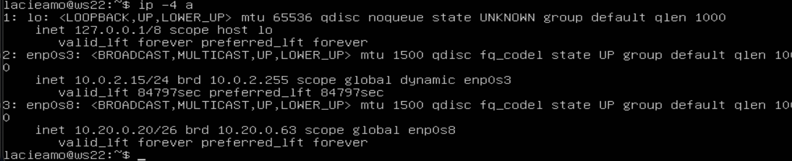

Пропингуем `ws22` c `ws21`, и  `r1` c `ws11`

### 5.2. Включение переадресации IP-адресов.

Для включения переадресации IP, выполняем команду на роутерах

> ` sudo sysctl -w net.ipv4.ip_forward=1 `

Откроем файл `/etc/sysctl.conf`

Раскомментируем строку `net.ipv4.ip_forward = 1` и сохраним изменения. Теперь IP-переадресация включена на постоянной основе.

### 5.3. Установка маршрута по-умолчанию

Настраиваем маршрут по-умолчанию (шлюз) для рабочих станций. Для этого добавляем `gateway4: ip роутера` в файле конфигураций `etc/netplan/00-installer-config.yaml`

После изменения настроек и вступления в силу изменений. Вызовем `ip r`, чтобы показать, что маршрут добавился в таблицу маршрутизации

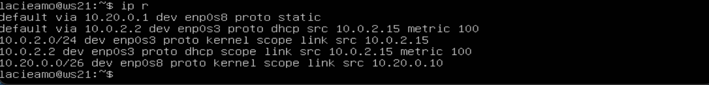

Пропингуем с ws11 роутер r2, пинг не пройдёт, т.к. роутер "не знает" куда вернуть ответ, при этом передача пакетов с машины осуществляется.

Чтобы посмотреть какие девайсы можно прослушать

tcpdump -D

Запускаем на r2 утилиту tcpdump, она позволяет прослушать порты и вывести на экран информацию с каких IP адресов приходят пакеты. В данном случае слушаем интерфейс enp0s8

tcpdump -tn -i enp0s8

Сначала на экране r2 будет пусто, идёт ожидание входящих пакетов

Запускаем ping на ws11

> ping -c 5 10.100.0.12

### 5.4. Добавление статических маршрутов

- Добавляем в роутеры r1 и r2 статические маршруты в файле конфигураций.

Применяем измениения.

С помощью `ip r` проверяем настройки на роутерах 
- 10.20.0.0/26 через 10.100.0.12 устройство enp0s9

- 10.10.0.0/18 через 10.100.0.11 устройство enp0s8

Запустить команды на `ws11`: `ip r list 10.10.0.0/18`, `ip r list 0.0.0.0/0`

Настройка статических маршрутов на роутерах r1 и r2 успешно завершена. Трафик к сети 10.10.0.0/18 маршрутизируется по более специфичному маршруту, что обеспечивает правильную доставку пакетов, в то время как остальные адреса используются маршрут по умолчанию.

### 5.5. Построение списка маршрутизаторов

Запустим на `r1` команду дампа

> `tcpdump -tnv -i enp0s8`

`-n` - не конвертировать адреса в имена;
`-t` - не выводить время при выводе каждой строкчи дампа;
`-v` - при синтаксическом анализе и выводить более подробную информацию. Например, печатаются время создания, общая длина и параметры IP-пакета. Также включает дополнительные проверки целостности пакетов, такие как проверка контрольной суммы заголовка IP и ICMP.

При помощи утилиты `traceroute` построим список маршрутизаторов на пути от `ws11` до `ws21`.

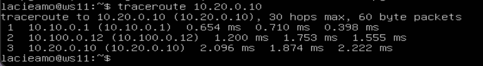

Каждый пакет проходит через определенное количество узлов в своем пути к цели. У каждого пакета есть TTL (Time To Live) — это число, определяющее количество узлов, которые пакет может пройти, прежде чем будет уничтожен. TTL записывается в заголовке пакета, и каждый промежуточный маршрутизатор уменьшает его на один при передаче пакета. Когда TTL достигает нуля, пакет уничтожается, и отправителю посылается сообщение Time Exceeded.

Утилита `traceroute` в Linux использует UDP-пакеты для трассировки маршрута. Она отправляет пакет с TTL=1 и записывает адрес первого откликнувшего узла. Затем она увеличивает TTL на каждом шаге (TTL=2, TTL=3 и т.д.) до достижения целевого узла. В процессе трассировки отправляется три пакета с каждым TTL, и измеряется время прохождения каждого из них. Пакеты отправляются на случайный UDP-порт, который вероятно не занят. Когда утилита получает сообщение от целевого узла о недоступности порта, трассировка считается завершенной.

### 5.6. Использование протокола ICMP при маршрутизации

Запустим на `r1` перехват сетевого трафика, проходящего через `enp0s8` с помощью команды

> `sudo tcpdump -n -i enp0s8 icmp`

Сохраняем дампы образов виртуальных машин

## Part 6. Динамическая настройка IP с помощью DHCP

### 6.1 Настройка службы DHCP на r2

Для r2 настроить конфигурацию службы `DHCP` в файле `/etc/dhcp/dhcpd.conf`

- в файле `/etc/resolv.conf`(содержит адреса серверов имен, к которым имеет доступ данная система) прописываем `nameserver 8.8.8.8`

- Перезагрузим службу DHCP

- Статус службы

- Изменим настройки машин ws21 и ws22 в файле конфигурации, чтобы сделать протокол DHCP активным. На каждой машине введём 

Перезагружаем виртуальную машину ws21 и смотрим присвоенный устройствам адрес

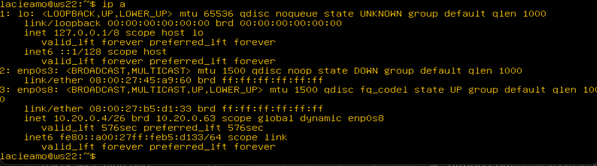

- Проверим соединение машины ws22 с ws21

### 6.2 Указание MAC-адреса

Чтобы указать MAC-адрес у ws11, в файл etc/netplan/00-installer-config.yaml надо добавить строки: macaddress: 10:10:10:10:10:BA, dhcp4: true

Для r1 настроим аналогично r2, но выдачу адресов сделаем с жесткой привязкой к MAC-адресу (ws11).

- Проводим аналогичные тесты - смотрим какой адрес назначен машине ws11

### 6.3 Обновление ip адреса с помощью команды sudo dhclient.

- Запросим с ws21 обновление ip адреса

Сохраняем дампы образов виртуальных машин.

## Part 7. NAT

### 7.1 Делаем сервер Apache2 общедоступным.

В файле /etc/apache2/ports.conf на ws22 и r2 меняем строку Listen 80 на Listen 0.0.0.0:80.

 

Запустить веб-сервер Apache на `ws22` и `r1`

### 7.2 Создаем фаервол на r2. Следующие правила:

При запуске файла ` firewall.sh ` с этими правилами, ` ws22 ` не должна "пинговаться" с ` r1 `.

Проверяем соединение между ` r1 ` и ` ws22 `

Проверяем соединение между ` ws22 ` и ` r1 `

- Разрешить маршрутизацию всех пакетов протокола ICMP, для этого прописываем правило для протокола *icmp* и цепочки *FORWARD*

Теперь при запуске файла ` firewall.sh ` с этими правилами, ` ws22 ` должна "пинговаться" с ` r1 `

Добавляем в файл ещё два правила:

- Включаем **SNAT**, а именно маскирование всех локальных ip из локальной сети, находящейся за ` r2 ` (по обозначениям из Части 5 - сеть 10.20.0.0)

- Включаем **DNAT** на 8080 порт машины ` r2 ` и добавим к веб-серверу Apache, запущенному на ` ws22 `, доступ извне сети

> Значения использованных опций:
> - ` t ` - указывает на используемую таблицу;
> - ` p ` - указывает протокол, такие как tcp, udp, udplite и другие, поддерживаемые системой, ознакомиться со списком можно в файле ` /etc/protocols `;
> - ` m ` - подключает указанный модуль;
> - ` s ` - указывает адрес источника пакета, в качестве значения можно указать как один IP-адрес, так и диапазон;
> - ` i ` - задает входящий сетевой интерфейс;
> - ` o ` - указывает исходящий сетевой интерфейс;
> - ` --dport ` - порт получателя пакета;
> - ` DNAT ` — подменяет адрес получателя в заголовке IP-пакета, основное применение — предоставление доступа к сервисам снаружи, находящимся внутри сети;
> - ` SNAT ` — служит для преобразования сетевых адресов, применимо, когда за сервером находятся машины, которым необходимо предоставить доступ в Интернет, при этом от провайдера имеется статический IP-адрес.

Проверить подмену IP-адреса можно с помощью команды tcpdump - пингуем с машины ws22 роутер r1, в выводе tcpdump будет отображаться с какого адреса идет запрос - IP-адрес r2

Проверяем соединение по TCP для DNAT, для этого с ` r1 ` подключаемся к серверу Apache на ` ws22 ` (обращаться по адресу ` r2 ` и порту 8080)

Сохраняем дампы образов виртуальных машин

## Part 8. Дополнительно. Знакомство с SSH Tunnels

Прочитать о основных возможностях SSH Tunnels можно [здесь](https://habr.com/ru/post/331348/ "Магия SSH"). [Статья 1](https://selectel.ru/blog/ssh-tunnels/ "SSH-туннели: практические примеры использования и важные функции"), [статья 2](https://habr.com/ru/post/435546/ "Практические советы, примеры и туннели SSH"), [статья 3](https://habr.com/ru/post/122445/ "Памятка пользователям ssh").

Скорее всего на нужных машинах ` apache2 ` не стоит и его нужно установить. Однако перед установкой желательно обновить систему

> ` sudo apt update `

> ` sudo apt upgrade -y `

- ` -y ` - при запросе сразу согласиться с установкой.

Устанавливаем ` apache2 `

> ` sudo apt install apache2 `

Запускаем веб-сервер ` Apache ` на ` ws22 ` только на ` localhost ` (то есть в файле ` /etc/apache2/ports.conf ` изменить строку ` Listen 80 ` на ` Listen localhost:80 `)

Переадресация локального порта позволяет перенаправить порт на локальном компьютере (клиент ssh) на порт на удаленном компьютере (сервер ssh), который затем перенаправляется на порт на компьютере назначения.
В этом типе переадресации клиент SSH прослушивает заданный порт и туннелирует любое подключение к этому порту к указанному порту на удаленном сервере SSH, который затем подключается к порту на целевом компьютере. Конечным компьютером может быть удаленный SSH-сервер или любой другой компьютер.

Пробрасывать порт от сервера будем по следующему алгоритму:
1) На машине ` ws22 `: создадим соединение с машины ` ws22 `, на которой установлен сервер ` ssh `, с машиной ` ws 21 `.
2) На машине ` ws22 `: с помощью команды ` ssh -L ` прокинем "прямое" соединение с машины ` ws21 ` на машину ` ws22 `.

Для контроля процессов соединей на запущенной машине с сервером apache2, проверим процессы с именем `sshd`

> `ps aux | grep sshd`

Здесь все процессы ` sshd ` которые запущены до момента создания ssh-туннеля на машине ` ws22 ` 

Создаём соединение. Запускаем на машине ` ws22 `

> ` ssh 10.20.0.20 `

 

Оставаясь на машине ` ws22 `, устанавливаем соединение с сервером ` ws22 ` от машины ` ws21 `

> ` ssh -L 8080:127.0.0.1:80 10.20.0.20 `

Проверяем процессы на машине ` ws22 ` после создания соединения 

> ` ps aux | grep sshd `

На машине ` ws21 ` запускаем утилиту ` telnet `

> ` telnet 127.0.0.1 8080 `

Проверяем запущенные процессы на машине ` ws21 ` и "убиваем" процесс отвечающий за соединение с сервером 

> ` ps aux | grep sshd `

Когда процесс, на машине ` ws21 `, отвечающий за соединение, будет "убит", появится сообщение на машине ` ws22 `

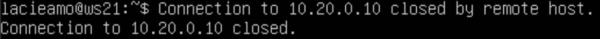

- Воспользоваться ` Remote TCP forwarding ` c ` ws11 ` до ` ws22 `, чтобы получить доступ к веб-серверу на ` ws22 ` с ` ws11 `.

Переадресация удаленного порта противоположна переадресации локального порта. Это позволяет перенаправить порт на удалённом компьютере (сервер ssh) на порт на локальном компьютере (клиент ssh), который затем перенаправляется на порт на компьютере назначения.
В этом типе переадресации сервер SSH прослушивает заданный порт и туннелирует любое соединение с этим портом на указанный порт локального клиента SSH, который затем подключается к порту на целевом компьютере. Машина назначения может быть локальной или любой другой машиной. Удаленное перенаправление портов в основном используется для предоставления доступа к внутренней службе кому-то извне.

Из-за того что на роутере ` r2 ` настроен firewall, подключиться к серверу Apache на машине ` ws22 ` с помощью команды ` ssh -L `, с машины ` ws11 `, не получится (роутер ` r2 ` не пропустит команду). В этом случае необходимо воспользоваться командой ` ssh -R `. Выполнить её необходимо на машине ` ws22 `. Это выполняется за несколько шагов:
1) На машине ` ws11 `: На машине ` ws11 `: переход с машины ` ws11 ` на роутер ` r2 ` с помощью ` ssh ` (роутер не позволит сразу перейти на машину ` ws22 `);
2) На машине ` ws11 `: переход с роутера ` r2 ` на машину ` ws22 ` с помощью ` ssh `;
3) На машине ` ws11 `: проброс туннеля с машины ` ws22 ` на машину ` ws11 ` с помощью ` ssh -R `;

Описание команды: 

> ` ssh -R [удаленный_адрес:]удаленный_порт:локальный_адрес:локальный_порт [пользователь@]сервер `

Пробрасываем маршрут. Запускаем с машины ` ws11 ` команду.

> ` ssh 10.100.0.12 `

Благодаря этой команде находясь на машине ` ws11 ` можно увидить следующую картину, в которой изменится хост текущей машины на ` r2 `

Находясь на машине ` ws11 `, получим следующий результат ` r2 ` -> ` ws22 `

В предыдущей части на роутере ` r2 ` был настроен на ` fireWall `, который не пропускает проходящие пакеты из другой сети. Поэтому сначала необходимо пробросить тунель от ` ws22 ` к ` ws11 `. Для этого запускаем на машине ` ws11 ` команду

> ` ssh -R 10.10.0.2:8080:127.0.0.1:80 10.10.0.2 `

Для проверки, сработало ли подключение, переходим во второй терминал (для этого находясь в терминале машины ` ws11 ` нажимаем ` option + fn + F2 ` или ` Alt + F2 `) и выполяем команду (` telnet 127.0.0.1 [локальный порт] `). В момент выполнения данной команды необходимо нажать любую клавишу

> ` telnet 127.0.0.1 8080 `

Сохраняем дампы образов виртуальных машин

